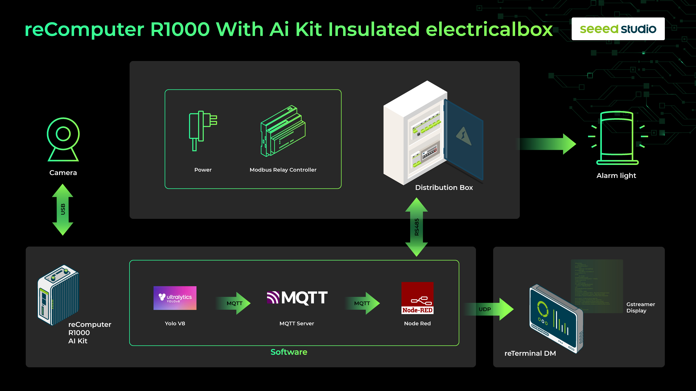
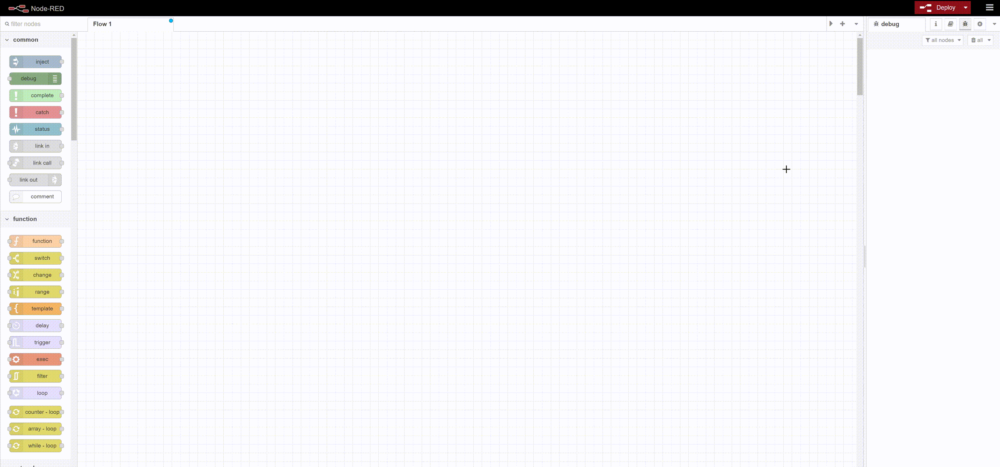
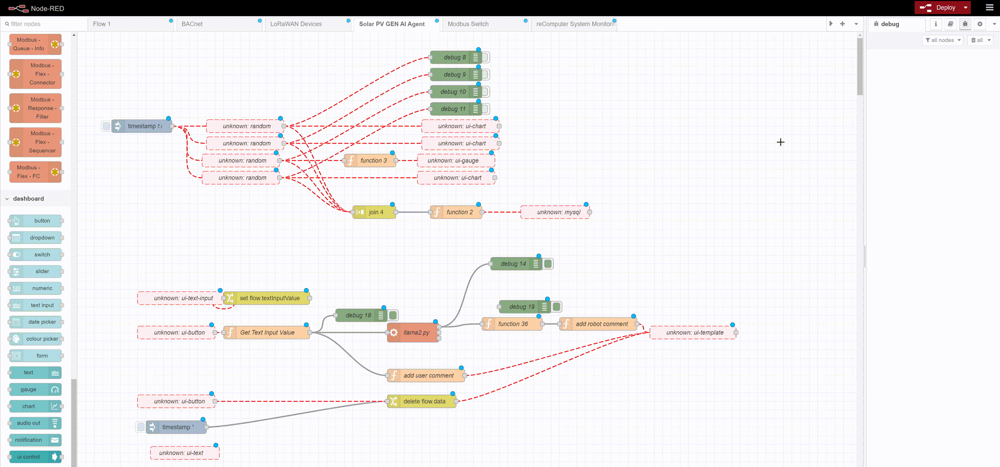
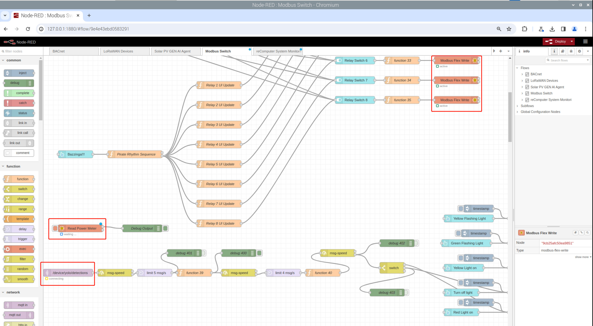
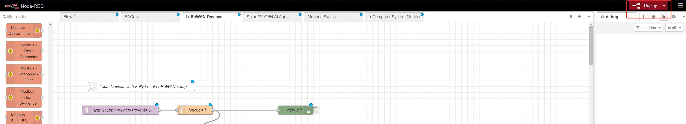

# Pose-Based_Light_Control_with_Node-Red_and_Raspberry_Pi_with_AIkit

Welcome to the Pose-Based Light Control project! This repository demonstrates how to create an intelligent lighting system that responds to human poses. By leveraging the power of an AI kit for pose detection and the flexibility of Node-RED for automation, this project allows you to control smart lights based on your movements.

In this project, a USB camera captures your pose, and yolov8n run on [AI kit](https://www.seeedstudio.com/Raspberry-Pi-AI-Kit-p-5900.html) with [reComputer R1000](https://www.seeedstudio.com/reComputer-R1025-10-p-5895.html) to detect your pose. The processed video, displaying the detected pose, is then streamed in real-time to [reTerminal DM](https://www.seeedstudio.com/reTerminal-DM-LTE-Cat-4-EC25-Bundle.html) using [gstreamer](https://gstreamer.freedesktop.org/). Meanwhile, the joint coordinates are sent using [mqtt](https://mqtt.org/) to [Node-RED](https://nodered.org/) which deploy on the reComputer R1000. At last, the Node-RED flow controls the smart lights based on the joint coordinates. 




# Deploy this project

## Hardware Preparation

> [!Note]
> You need a USB camera connect reComputer R1000.

### [reComputer R1000](https://www.seeedstudio.com/reComputer-R1025-10-p-5895.html): Raspberry Pi CM4 Gateway, 4GB RAM, 32GB eMMC  
<div align='center'></div>

### [Raspberry Pi AI Kit](https://www.seeedstudio.com/Raspberry-Pi-AI-Kit-p-5900.html)
<div align='center'></div>

### [reTerminal DM](https://www.seeedstudio.com/reTerminal-DM-LTE-Cat-4-EC25-Bundle.html)
<div align='center'></div>

## Install AI kit to reComputer R1000 

Please refer to this [guid](https://wiki.seeedstudio.com/yolov8_pose_estimation_on_recomputer_r1000_with_hailo_8l/)


## Install Pose_estimation and run on reComputer R1000

> [!Note]
> Please make sure your reComputer R1000 and reTerminal DM are connected to the same network.

1. Clone this repository to your reComputer R1000

```
git clone https://github.com/LJ-Hao/Pose-Based_Light_Control_with_Node-Red_and_Raspberry_Pi_with_AIkit.git && cd Pose-Based_Light_Control_with_Node-Red_and_Raspberry_Pi_with_AIkit
```

2. Edit the `pose_estimation.py` file and change the `mqtt_server` to your reTerminal DM's IP address. And change the Gstreamer pipeline to your reTerminal DM's IP address. And then run the command below to start the pose estimation.

```shell
bash run.sh pose_estimation.py
```
## Run Node-RED flow

**Step 1**: Install Node-RED. You can download Node-RED with just one line of command
```
bash <(curl -sL https://raw.githubusercontent.com/node-red/linux-installers/master/deb/update-nodejs-and-nodered)
```
**Step 2**:Click [here](https://github.com/LJ-Hao/Pose-Based_Light_Control_with_Node-Red_and_Raspberry_Pi_with_AIkit/blob/main/flows.json) to download our project files

**Step 3**:Import project files. Click `Settings => Import` in the upper right corner, click `select a file to import` in the new pop-up window, select the downloaded json file, and finally click `Import`.

<center></center>

**Step 4**:After importing the project file, the system may prompt that your node-red is missing some controls. You need to download the following controls:
```shell
@bartbutenaers/node-red-rtsp-to-mjpeg
@chirpstack/node-red-contrib-chirpstack
@flowfuse/node-red-dashboard
node-bacnet-contrib-extended
node-red-contrib-buffer-parser
node-red-contrib-image-output
node-red-contrib-image-tools
node-red-contrib-modbus
node-red-contrib-msg-speed
node-red-contrib-multipart-stream-encoder
node-red-contrib-onvif
node-red-contrib-play-audio
node-red-dashboard
node-red-node-base64
node-red-node-mysql
node-red-node-pi-gpio
node-red-node-ping
node-red-node-serialport
node-red-node-smooth
node-red-sensecap-paas
node-red-node-random
```
Take `node-red-node-random` as an example, click `Settings => Manage Palette` in the upper right corner, select the `Install` column in the new window, enter `node-red-node-random`, and finally click `Install `Button.

<center></center>

**Step 5**:You need to modify the IP address of MQTT and the serial port number of ModbusRTU, and set them to match your device.

<center></center>

**Step 6**:Click the deploy button in the upper right corner and the system will run normally.
<center></center>

## Install receiver and run on reTerminal DM

1. Install the gstreamer on reTerminal DM.

```
apt-get install libgstreamer1.0-dev libgstreamer-plugins-base1.0-dev libgstreamer-plugins-bad1.0-dev gstreamer1.0-plugins-base gstreamer1.0-plugins-good gstreamer1.0-plugins-bad gstreamer1.0-plugins-ugly gstreamer1.0-libav gstreamer1.0-tools gstreamer1.0-x gstreamer1.0-alsa gstreamer1.0-gl gstreamer1.0-gtk3 gstreamer1.0-qt5 gstreamer1.0-pulseaudio
```

2. Clone this repository to your reTerminal DM and run the command below to start the video receiver.

```
git clone https://github.com/LJ-Hao/Pose-Based_Light_Control_with_Node-Red_and_Raspberry_Pi_with_AIkit.git && cd Pose-Based_Light_Control_with_Node-Red_and_Raspberry_Pi_with_AIkit
python3 video_receiver.py
```

## Result 

We showed this demonstration in a youtube live broadcast, and you can watch the video here:

[](https://www.youtube.com/watch?v=v-S6_tH75NI&t=1332s)


