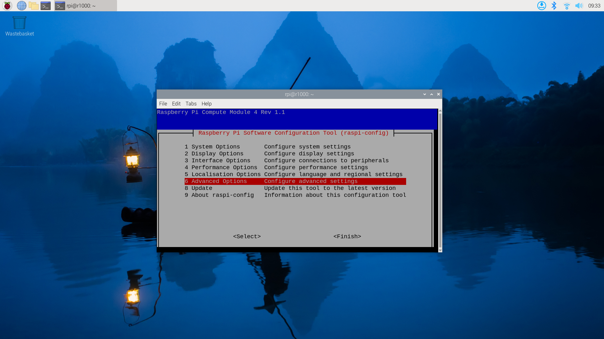
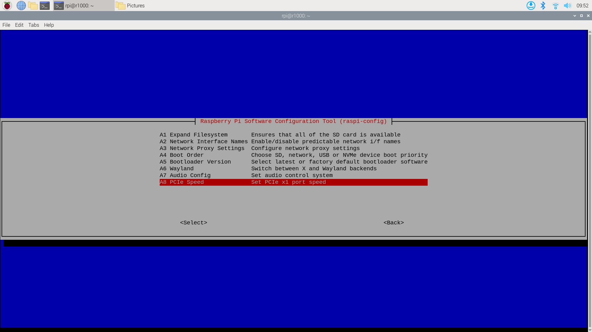
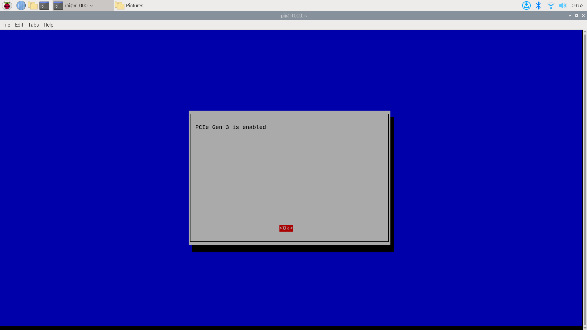
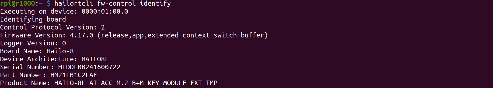
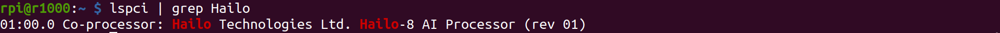
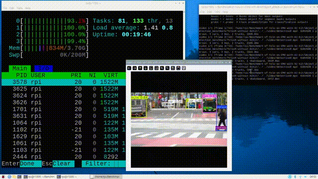
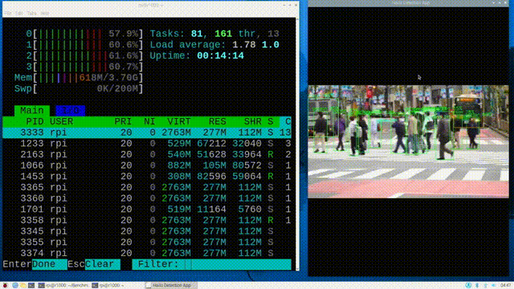

# Running YOLOv8 Object Detection on reComputer R1000(CM4-Powered Edge Gateway) with Hailo-8L 
This repository demonstrates object detection model using YOLOv8 on a Raspberry Pi CM4 with Hailo Acceleration. The Raspberry Pi AI Kit enhances the performance of the Raspberry Pi and unlock its potential in artificial intelligence and machine learning applications, like smart retail, smart traffic and more. Although the Raspberry AI Kit is designed for Raspberry Pi 5, we have experimented it on our CM4-powered edge gateway. Excited about turning our edge device into an intelligent IoT gateway! 
# Hardware Preparation
## [reComputer R1000](https://www.seeedstudio.com/reComputer-R1025-10-p-5895.html): Raspberry Pi CM4 Gateway, 4GB RAM, 32GB eMMC  
<div align='center'></div>

## [Raspberry Pi AI Kit](https://www.seeedstudio.com/Raspberry-Pi-AI-Kit-p-5900.html)
<div align='center'></div>

# Install Hailo-8L on the reComputer R1000

## step 1. Install the Hailo-8L on the Raspberry Pi CM4


## Step 2. Update system & Set pcie to gen3

```
sudo apt update
sudo apt full-upgrade
sudo raspi-config
```
Select option "6 Advanced Options":
<div align='center'></div>
Then select option "A8 PCIe Speed":
<div align='center'></div>
Choose "Yes" to enable PCIe Gen 3 mode:
<div align='center'></div>
Click "Finish" to exit.
<div align='center'></div>

## Step 3. Install Hailo Software & Verify Installation

Install hailo-all and reboot
```
sudo apt install hailo-all
sudo reboot
```

Check that the Hailo software is installed correctly by running the following command:

```
hailortcli fw-control identify
```

The true result is as follows:
<div align='center'></div>

Check hailo hardware is installed correctly by running the following command:

```
lspci | grep Hailo
```
The true result is as follows:
<div align='center'></div>

# Run this project

## Run object detection on the Recomputer1000 without AI kit

### Step 1. Install the repository

```
git clone https://github.com/Seeed-Projects/Running-YOLOv8-Object-Detection-on-reComputer-R1000-CM4-Powered-Edge-Gateway-with-Hailo-8L.git
```
### Step 2. The following command to run the object 
```
cd Running-YOLOv8-Object-Detection-on-reComputer-R1000-CM4-Powered-Edge-Gateway-with-Hailo-8L/object_detection_benchmark/Yolov8-with-AIkit
bash ./run.sh
```
### Result



## Run object detection on the Recomputer1000 with AI kit

### Step 1. Install the repository

```
git clone https://github.com/Seeed-Projects/Running-YOLOv8-Object-Detection-on-reComputer-R1000-CM4-Powered-Edge-Gateway-with-Hailo-8L.git
```

### Step 2. The following command to run the object 

```
cd Running-YOLOv8-Object-Detection-on-reComputer-R1000-CM4-Powered-Edge-Gateway-with-Hailo-8L/object_detection_benchmark/Yolov8-without-AIkit
bash ./run.sh
```

### Result


# Results

| Model | Without Hailo | With Hailo |
| --- | --- | --- |
| YOLOV8 Object Detection| 0.75FPS | 29.5FPS |
